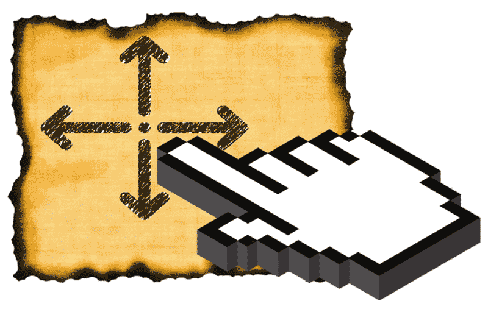
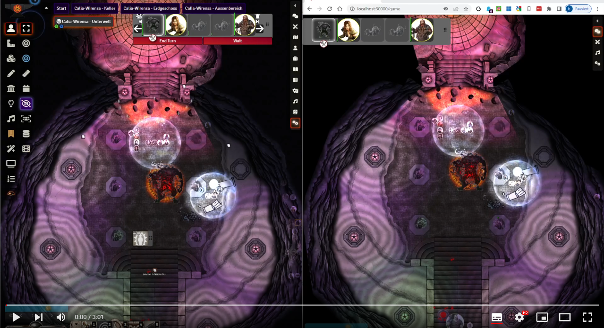
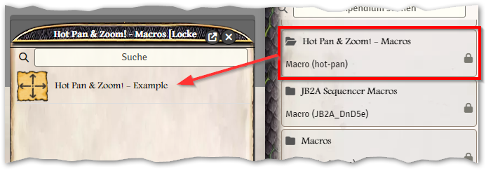
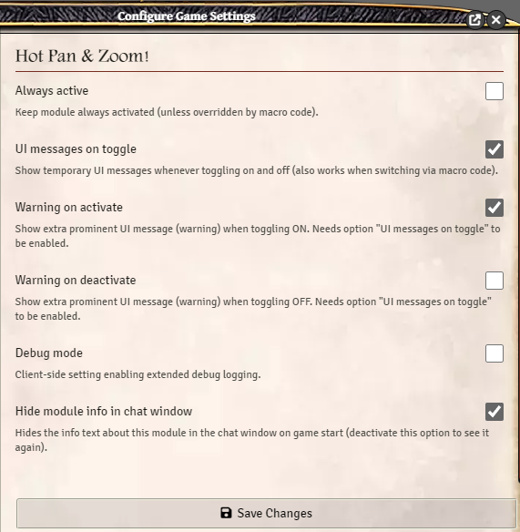
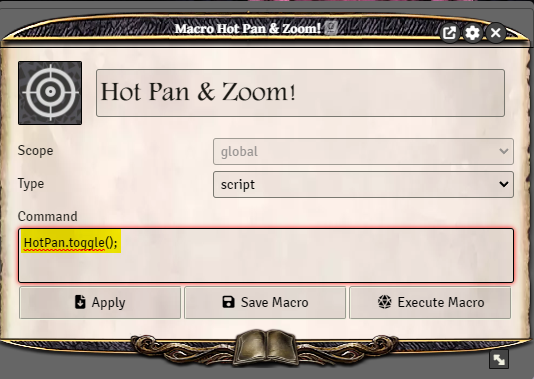

# Hot Pan & Zoom! for Foundry VTT
<table style="border:0">
  <tr>
    <td></td>
    <td>Take control over your players' canvas position and zoom (manually or by macro) for demonstrations and cinematics. 
         
        <i><strong>"One Thing to Pan Them! 
            One Thing to Find Them! 
            One Thing to Zoom them 
            And to the GM's Canvas Bind Them!"</strong></i>
    </td>
  </tr>
</table>

## Video demo on youtube
[Hot Pan & Zoom! Demo](https://youtu.be/irUmWkSJ_4M)

- [What does it do ...](#what-does-it-do-)
- [Changelog](#changelog)
- [Upcoming features](#upcoming-features)
- [Tech stuff](#tech-stuff)
  * [Adjustable module settings (i.e. game settings)](#adjustable-module-settings--ie-game-settings-)
  * [Control it by macro!](#control-it-by-macro-)
  * [Compatibility and Dependencies](#compatibility-and-dependencies)
- [Troubleshooting](#troubleshooting)
  * [Switching off after switching on inside the same macro fails](#switching-off-after-switching-on-inside-the-same-macro-fails)
  
  <small><i><a href='http://ecotrust-canada.github.io/markdown-toc/'>Table of contents generated with markdown-toc</a></i></small>

## What does it do ...
Are you tired of your players complaining about things like...
- *"Hey, where's my token gone again?"*
- *"Where the h... are you (the GM)? I think you've lost us! What are you trying to show us over there?"*

It happens to me quite often that I (as the GM) like panning and scrolling around, enthusiastically trying to demonstrate something in the scene to my players, but I tend to forget that they cannot follow me on their screens!
So I am frequently losing their attention without noticing.

And a more fancy thing: I like scripting big macros for playing cinematic animation sequences that do a lot of stuff across the scene. But then I forget that most of it won't be noticed by the players, as it happens to take place in a far-away corner of the scene that they are currently just *not* looking at! :(

**This is why I've created this whole thing.**

It is a systems-agnostic utility for keeping players' canvas position & zoom in sync with the GM's screen.

For instance, it allows to take over control of the players' canvas for a short time to draw their attention to important things ("Hey! Have a look at THIS!").

And it comes in handy for cinematic reasons, like in the animation sequence shown in the video demo. Feel free to experiment!

## Changelog
<table style="border:0">
    <tr>
        <th colspan="3" style="text-align: left">Latest Version</th>
    </tr>
    <tr>
        <td>1.1.0</td>
        <td>2023-02-25</td>
        <td>
            <ol>
                <li>
                    <b>Introducing new "silentMode" parameter for suppressing UI messages on demand:</b> 
                    Especially when automating Hot Pan & Zoom in macros, UI messages can be tedious. 
                    Instead of switching them of in the game settings, you can now suppress them for individual calls of <i>switchOn(), switchOff(), switchBack() and toggle()</i> by an optional paramter: 
                    <i>swichOn(<b>true</b>);</i> 
                    <i>swichOff(<b>true</b>);</i> 
                    <i>swichBack(<b>true</b>);</i> 
                    <i>toggle(<b>true</b>);</i>
                </li>
                <li>Various minor refactorings</li>
            </ol>
        </td>
    </tr>
</table>

Click to see older versions

<table>
    <tr>
        <th>Release</th>
        <th>Date</th>
        <th>Changes</th>
    </tr>
    <tr>
        <td>1.0.2</td>
        <td>2023-02-21</td>
        <td>
            <ul>
                <li><b>Example macro(s) now provided as compendium pack:</b> 
                    Find included a compendium pack with a default macro that can easily be adjusted to your needs. 
                    Find further explanations inline in the macro's code: 
                    
                    </li>
            </ul>
        </td>
    </tr>
    <tr>
        <td>1.0.1</td>
        <td>2023-02-20</td>
        <td>
            <ol>
                <li><b>More intuitive Macro API:</b> 
                    Use <i>HotPan.switchBack()</i> now instead of <i>HotPan.switchOff(restoreStateBefore=true)</i> 
                    (Old function still valid, but flagged as deprecated. Migration recommended.) </li>
                <li><b>Stability workaround for Macro API:</b> 
                    Toggling within a single macro script (<i>switchOn() => switchOff()/switchBack(), toggle() => toggle()</i>) was unreliable. 
                    Some weird asynchronicity / threading behaviour which I couldn't really understand. .
                    Added some await / Promise logic, plus updated documentation about macro usage (new troubleshooting section). 
                    Any feedback on better solutions highly appreciated!</li>
            </ol>
        </td>
    </tr>
    <tr>
        <td>1.0.0</td>
        <td>2023-02-18</td>
        <td>Going out into the world!</td>
    </tr>
</table>

This "canvas sync" is currently a pure GM feature. It does not support players to use it yet (maybe to come in a later release).

## Upcoming features
Feel free to follow the ["dev" branch on GitHub](https://github.com/coffiarts/FoundryVTT-hot-pan/tree/dev) to stay tuned: [https://github.com/coffiarts/FoundryVTT-hot-pan/tree/dev](https://github.com/coffiarts/FoundryVTT-hot-pan/tree/dev)

Some things I am *considering* to do (feedback welcome!):

- `small`: ~~include ready-to-use macros for the most basic functions in the package~~ => **DONE (Rel. 1.0.2)** 
- `medium`: ~~expose some more features for usage in macros, e.g. better control over UI notifications~~ => **DONE (Rel. 1.0.3)**
- `big`: allow players to request screen control as well (probably needs some socket-based mechanism for GM approval at runtime, so this might be complex)

## Tech stuff
### Adjustable module settings (i.e. game settings)
This screenshot shows the default values.

(!) Note that especially the UI notification messages can be configured to your needs.

### Control it by macro!
The module runs automatically in the backend as a module, but it can also easily be controlled through macro code.

The module comes with its own macro compendium pack containing just one prebuilt example. Use and modify this according to your needs:

The macro uses the exposed `class HotPan` - just like this, it's a no-brainer:

Some variants:

    // Toggle specifically on and off (pretty obvious)
    HotPan.switchOn();
    HotPan.switchOff(); // If this doesn't work, refer to "Troubleshooting" below
    
    // If your macro should not rely on HotPan being installed, to prevent runtime issues,
    // use it optionally (by using "?")
    HotPan?.switchOn();
    
    // And now for the advanced scenarios:
    // Use HotPan (optionally) in a macro running a multi-step animation sequence,
    // AND prevent that the GM's preference (active state of the mod) is not overridden afterwards:
    
    // Step 1: activate Hot Pan & Zoom!
    HotPan?.switchOn();
    // A special recommendation here is to suppress UI messages (supported as of v1.1.0)
    HotPan?.switchOn(true); // true means "silentMode", being effective always for a single switch action 
    
    // Step 2: Run all your fancy animation stuff and watch the players' map view following yours
    <...>
    
    // Step 3: When all is done, switch of HotPan again, but gracefully: If the user setting was ON before,
    // you don't want to set it to OFF now!
    // This is done by using the switchBack(true) method instead of switchOff(true). True, again, meaning "silentMode", which is the recommendation during macro automation
    HotPan?.switchBack(true);  // If this doesn't work, refer to "Troubleshooting" below

### Compatibility and Dependencies
- ***Hot Pan & Zoom!*** uses [socketlib](https://github.com/manuelVo/foundryvtt-socketlib) for sending sync messages between the GM's session and the clients.
- Developed and tested on Foundry VTT 10.2xx, with Chrome as the players' client.
- **DISCLAIMER:** Be aware that I have developed and tested this mainly in local network sessions (including plain localhost connections)! So I can't claim to have run tough reality checks with this. So I am very eager to know how it works out for others!

## Troubleshooting
### Switching off after switching on inside the same macro fails
Toggling within a single thread (like a macro script) (e.g. <i>switchOn() => switchOff()/switchBack(), toggle() => toggle()</i>) can be unreliable.
It's some weird asynchronicity / threading issue I haven't fully understood.

Workaround:

    // Toggle on (as usual)
    HotPan.switchOn();
    <...>
    // But for switching off, encapsulate function calls within setTimeout():
    setTimeout(function(){HotPan.switchOff()}, 100);
    <or>
    setTimeout(function(){HotPan.switchBack()}, 100);
    <or>
    setTimeout(function(){HotPan.toggle()}, 100);

This might be an ugly solution caused by my noob-i-ness, any better ideas highly appreciated!
