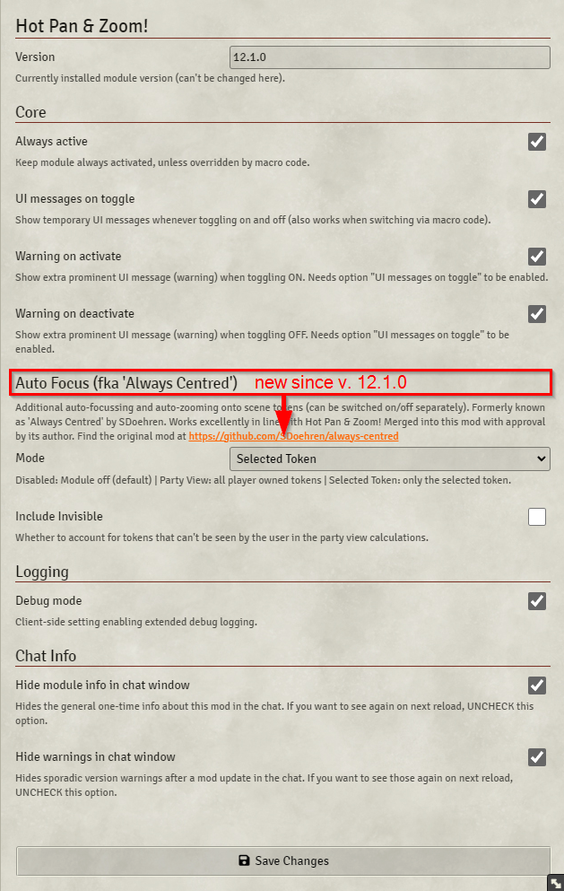

# Hot Pan & Zoom! for Foundry VTT
*"One Thing to Pan Them! One Thing to Find Them! One Thing to Zoom them and to the GM's Canvas Bind Them!"*

## What does it do?
Have a look at the video demo: [Hot Pan & Zoom! Demo on youtube](https://youtu.be/irUmWkSJ_4M)

***Hot Pan & Zoom!*** is a systems-agnostic utility for keeping players' canvas position & zoom in sync with the GM's screen.

By this, you (as the GM) have a convenient option to point players' attention to relevant things.

Best practise is always to use this only temporarily in specific situation ("hey all of you, please have a look at THIS!"). That's why the feature can be toggled on and of, either in the game settings or by a very easy-to-create custom macro (see below).

Even more, you can use it for cinematic reasons, like in the long animation sequence shown in the video above. Feel free to experiment!

This "canvas sync" is considered a pure GM feature in this mod. It does not support players to use it.

## Tech stuff
### Module settings (under game settings)
This screenshot shows the default values.

(!) Note that especially the UI notification messages can be configured to your needs.

### Control it by macro!
The module runs automatically in the backend as a module, but it can also easily be controlled through macro code.

For this, use the exposed `class HotPan` - just like this, it's a no-brainer:

Some more variants:

    // Toggle specifically on and off (pretty obvious)
    HotPan.switchOn();
    HotPan.switchOff();
    
    // If your macro should not rely on HotPan being installed, to prevent runtime issues,
    // use it optionally (by using "?")
    HotPan?.switchOn();
    
    // And now the advanced scenario:
    // Use HotPan (optionally) in a macro running a multi-step animation sequence,
    // AND prevent that the GM's preference (active state of the mod) ist not overriden afterwards:
    
    // Step 1: activate Hot Pan & Zoom!
    HotPan?.SetOn();
    
    // Step 2: Run all your fancy animation stuff and watch the players' map view following yours
    <...>
    
    // Step 3: When all is done, switch of HotPan again, but gracefully: If the user setting was ON before,
    // you don't want to set it to OFF now!
    // This is done by using the restoreStateBefore param
    HotPan?.switchOff(restoreStateBefore=true);

### Compatibility & Dependencies
- ***Hot Pan & Zoom!*** uses [socketlib](https://github.com/manuelVo/foundryvtt-socketlib) for sending sync messages between the GM's session and the clients.
- Developed and tested on Foundry VTT 10.2xx, with Chrome as the players' client.
- **DISCLAIMER:** Be aware that I have developed and tested this mainly in local network sessions (including plain localhost connections)! So I can't claim to have run tough reality checks with this. So I am very to know how it works out for others!

